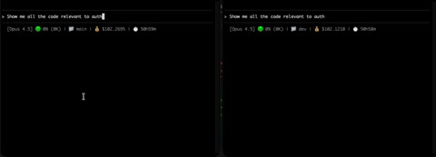

# Grepl

Semantic code search CLI using ChromaDB + Ollama. Integrates with Claude Code via Skills.

**No Docker required.** Everything runs locally.



*Video sped up 5x. With Grepl: 37s | Without Grepl: 1m 20s*

## Architecture

```
Claude Code → Skill → grepl CLI → ChromaDB + Ollama
                      (Python)     (embedded)  (local)
```

## Quick Start

### 1. Install Ollama

```bash
# macOS
brew install ollama

# Start Ollama (keep running in background)
ollama serve

# Pull embedding model
ollama pull nomic-embed-text
```

### 2. Install Grepl

**Option A: Via Homebrew (recommended)**
```bash
brew tap dyoburon/grepl
brew install grepl
```

**Option B: Via pip**
```bash
pip install -e /path/to/grepl
```

**Option C: Via pipx**
```bash
pipx install /path/to/grepl
```

### 3. Verify Installation

```bash
grepl --help
```

### 4. Index Your Codebase

```bash
cd /path/to/your/project
grepl index .
```

### 5. Search!

```bash
grepl search "authentication logic"
grepl search "error handling" -n 20
grepl exact "TODO"  # Exact pattern match
grepl read src/auth.py:45  # Read context around line 45
```

## Usage

### Index a Codebase
```bash
grepl index .
grepl index /path/to/project
grepl index . --force  # Reindex
```

### Semantic Search
```bash
grepl search "authentication logic"
grepl search "how errors are handled" -n 20
grepl search "database queries" -p /path/to/project
```

### Exact Pattern Match
```bash
grepl exact "TODO"
grepl exact "def process_payment"
grepl exact "import React" -p ./src
grepl exact -i "error" -p ./src      # Case-insensitive
grepl exact "foo|bar|baz" -n 20      # Multiple patterns (OR)
```

### Read Files
```bash
grepl read src/auth.py              # Read first 50 lines
grepl read src/auth.py:45           # Read ~50 lines centered on line 45
grepl read src/auth.py:30-80        # Read lines 30-80
grepl read src/auth.py -c 100       # Read 100 lines of context
```

## For LLMs: grep/sed → grepl Cheatsheet

If you're an LLM (Claude Code, etc.), use grepl instead of grep/sed/cat. Here's the mapping:

| Instead of | Use |
|------------|-----|
| `grep -n "pattern" file` | `grepl exact "pattern" -p file` |
| `grep -in "pattern" file` | `grepl exact -i "pattern" -p file` |
| `grep -n "a\|b\|c" file` | `grepl exact "a\|b\|c" -p file` |
| `grep -rn "pattern" dir` | `grepl exact "pattern" -p dir` |
| `sed -n '10,50p' file` | `grepl read file:10-50` |
| `cat file \| head -50` | `grepl read file` |
| `cat file` | `grepl read file -c 1000` |

### Key Flags

```bash
grepl exact [OPTIONS] PATTERN
  -p, --path TEXT      Path to search (file or directory, default: .)
  -n, --limit INTEGER  Max number of results
  -i, --ignore-case    Case-insensitive search

grepl search [OPTIONS] QUERY
  -p, --path TEXT      Project path (default: .)
  -n, --limit INTEGER  Number of results (default: 10)

grepl read LOCATION
  file.py              # First 50 lines
  file.py:45           # ~50 lines centered on line 45
  file.py:30-80        # Lines 30-80
  -c, --context INT    # Lines of context (default: 50)
```

### Check Status
```bash
grepl status
grepl status /path/to/project
```

### Clear Index
```bash
grepl clear
```

## Claude Code Integration

### Setup

Create a `.claude` folder in your project with these files:

#### 1. `.claude/settings.json`

```json
{
  "permissions": {
    "allow": [
      "Bash(grepl:*)"
    ],
    "deny": [
      "Glob",
      "Grep",
      "Read",
      "Task(Explore)"
    ]
  }
}
```

This blocks Claude's native search/read tools, forcing it to use grepl for all code operations.

#### 2. `.claude/skills/code-search/SKILL.md`

```markdown
---
name: code-search
description: Semantic code search for finding code by meaning. Use when searching for concepts, logic, patterns, or asking "where is X handled" or "find code that does Y".
allowed-tools: Bash(grepl:*)
---

# Code Search Skill

## When to Use This Skill

Use `grepl search` for:
- Finding code by concept ("authentication logic", "error handling")
- Exploring unfamiliar codebases
- Searching by intent, not exact text

Use `grepl exact` for:
- Specific strings, function names, imports
- TODOs, FIXMEs, exact patterns

Use `grepl read` for:
- Reading file contents after finding a match
- Viewing context around a specific line

## Commands

### Semantic Search
\`\`\`bash
grepl search "your query" -n 10
\`\`\`

### Exact Match
\`\`\`bash
grepl exact "pattern"
\`\`\`

### Read File
\`\`\`bash
grepl read file.py:45    # Context around line 45
grepl read file.py:30-80 # Lines 30-80
\`\`\`
```

#### 3. Add to `CLAUDE.md` (recommended)

Add this to your project's `CLAUDE.md` file:

```markdown
## Code Search - IMPORTANT

**Always use `grepl` for all code operations in this codebase.** Do NOT use Glob, Grep, Read, or the Explore agent.

\`\`\`bash
# Semantic search (find by meaning/concept)
grepl search "authentication logic"

# Exact pattern match
grepl exact "def process_payment"

# Read file contents
grepl read src/auth.py:45
\`\`\`

The index is already built. Just run the search commands directly.
```

### Quick Setup (Copy Files)

Or simply copy the `.claude` folder from grepl:

```bash
cp -r /path/to/grepl/.claude /path/to/your/project/
```

Then restart Claude Code to load the settings.

### How It Works

**Layer 1: Permissions (Enforcement)** - Native tools are denied in settings.json:
```
Claude tries Grep/Glob/Read → DENIED → Must use grepl instead
```

**Layer 2: Skill (Guidance)** - The skill teaches Claude when and how to use grepl:
```
"find authentication logic" → Skill matches → grepl search "authentication"
```

**Layer 3: CLAUDE.md (Instruction)** - Explicit instruction to use grepl for all code operations

## Data Storage

Grepl stores indexes in `~/.grepl/chroma/`. Each project gets its own collection.

## Keeping Ollama Running (Recommended)

Ollama stops when your terminal closes or Mac sleeps. Here's how to keep it running automatically.

### Option 1: Hammerspoon (macOS)

If you use [Hammerspoon](https://www.hammerspoon.org/), add this to your `~/.hammerspoon/init.lua`:

```lua
-- Ollama Keepalive
-- Ensures Ollama is always running for grepl

local ollamaPath = "/opt/homebrew/bin/ollama"  -- Apple Silicon
-- local ollamaPath = "/usr/local/bin/ollama"  -- Intel Mac

local function isOllamaRunning()
    local output, status = hs.execute("pgrep -x ollama")
    return status
end

local function startOllama()
    if not isOllamaRunning() then
        hs.task.new(ollamaPath, nil, {"serve"}):start()
    end
end

-- Start on launch
startOllama()

-- Check every 5 minutes
hs.timer.doEvery(300, startOllama)

-- Restart after wake from sleep
hs.caffeinate.watcher.new(function(event)
    if event == hs.caffeinate.watcher.systemDidWake then
        hs.timer.doAfter(2, startOllama)
    end
end):start()
```

Then reload Hammerspoon: `hs -c "hs.reload()"`

### Option 2: LaunchAgent (macOS)

Create a LaunchAgent that auto-starts Ollama on login:

```bash
cat > ~/Library/LaunchAgents/com.ollama.serve.plist << 'EOF'
<?xml version="1.0" encoding="UTF-8"?>
<!DOCTYPE plist PUBLIC "-//Apple//DTD PLIST 1.0//EN" "http://www.apple.com/DTDs/PropertyList-1.0.dtd">
<plist version="1.0">
<dict>
    <key>Label</key>
    <string>com.ollama.serve</string>
    <key>ProgramArguments</key>
    <array>
        <string>/opt/homebrew/bin/ollama</string>
        <string>serve</string>
    </array>
    <key>RunAtLoad</key>
    <true/>
    <key>KeepAlive</key>
    <true/>
</dict>
</plist>
EOF

launchctl load ~/Library/LaunchAgents/com.ollama.serve.plist
```

### Option 3: Ollama Desktop App

Download from [ollama.com](https://ollama.com). The desktop app runs as a menu bar item and auto-starts on login.

## Troubleshooting

| Issue | Fix |
|-------|-----|
| Ollama not running | `ollama serve` (or see "Keeping Ollama Running" above) |
| Model not found | `ollama pull nomic-embed-text` |
| grepl not found | `brew tap dyoburon/grepl && brew install grepl` |
| Index missing | `grepl index .` |
| Skill not activating | Restart Claude Code |

## Cost

| Component | Cost |
|-----------|------|
| ChromaDB | $0 (embedded, local) |
| Ollama | $0 (local) |
| **Total** | **$0** |

## Tech Stack

- **ChromaDB**: Embedded vector database (no server)
- **Ollama**: Local embeddings via nomic-embed-text
- **Python**: Simple, portable CLI

## Experiments

Benchmarks comparing Grepl vs standard Claude Code exploration are in the `experiments/` folder.

### Chart Generation Search (2026-01-07)

Task: Find all code related to chart generation logic in the datafeeds project.

| Metric | With Grepl | Without Grepl |
|--------|-------------|----------------|
| Duration | 1m 16s | 2m 26s |
| Tokens | 400 | 15,309 |
| Cost | $0.02 | $0.44 |

**Result: Grepl was 2x faster and 22x cheaper.**

### Why Is It So Much Cheaper?

**Without Grepl**, the LLM has to *read actual file contents* to understand what's in them. It issues Glob/Grep commands, reads files, processes them, searches more, reads more files. All that file content goes into the context window, burning through tokens. The LLM is essentially reading your entire codebase to find what it's looking for.

**With Grepl**, Ollama does the semantic search *locally* (free, no tokens). ChromaDB returns relevant file paths and snippets. The LLM only sees the search results—a few lines per match—not entire files.
